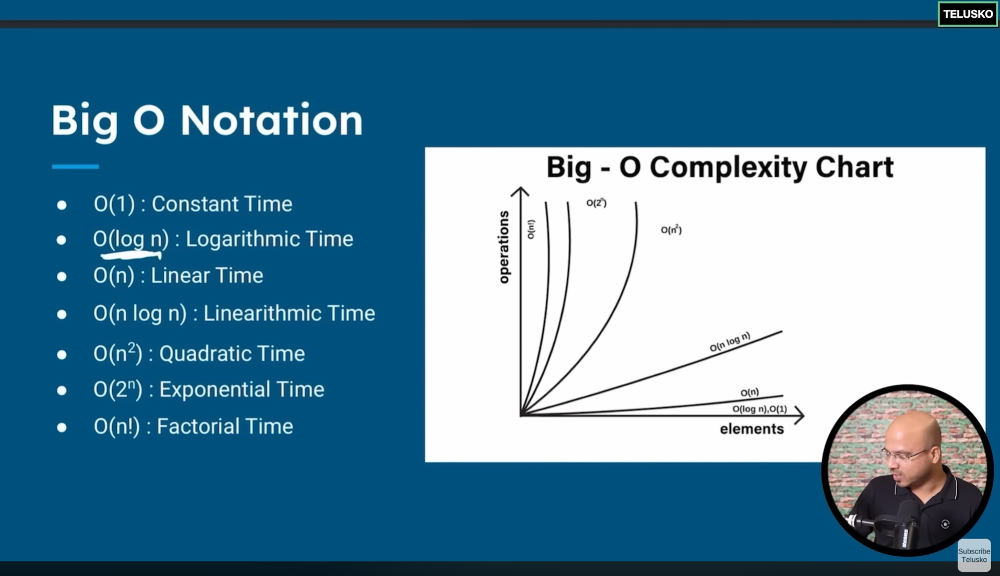

## *From Basic To Advanced java, is here in this repository*

# Topics
- Introduction to Java Course ===== ✅
- Java Development Kit setup ===== ✅
- First code in java ===== ✅
- How Java Works ===== ✅
- Variables in java ===== ✅
- Data types in java ===== ✅
- Literal ===== ✅
- Type conversion (Implicit & Explicit) ===== ✅
- Assignment Operators (=) ===== ✅
- Relational Operators ===== ✅
- Logical Operators (&,|,!=) ===== ✅
- If Else ===== ✅
- If Else if ===== ✅
- ternary :? ===== ✅
- Switch Statement ===== ✅
- Need For Loop ===== ✅
- While Loop ===== ✅
- Do While Loop ===== ✅
- For Loop ===== ✅
- Which Loop To Use ===== ✅
- Class And Object Theory ===== ✅
- Class and Object Practical ===== ✅
- JDK JRE JVM ===== ✅
- Methods ===== ✅
- Method Overloading ===== ✅
- Stack And Heap ===== ✅
- Need of an Array ===== ✅
- Creation of Array ===== ✅
- Multi Dimensional Array ===== ✅
- Jagged and 3D Array ===== ✅
- Drawbacks of Array ===== ✅
- Array of Objects ===== ✅
- Enhanced for loop ===== ✅
- What is String ===== ✅
- Mutable vs Immutable string ===== ✅
- StringBuffer and StringBuilder ===== ✅
- static variable ===== ✅
- static block ===== ✅
- static method ===== ✅
- Encapsulation ===== ✅
- Getters and setters ===== ✅
- this keyword ===== ✅
- constructor ===== ✅
- default vs parameterized constructor ===== ✅
- this and super method ===== ✅
- Naming Convention ===== ✅
- Anonymous Object ===== ✅
- Need of Inheritance ===== ✅
- What is Inheritance ===== ✅
- Single and Multilevel inheritance ===== ✅
- Multiple Inheritance ===== ✅
- Method Overriding ===== ✅
- packages ===== ✅
- Access Modifiers ===== ✅
- Polymorphism ===== ✅
- Dynamic Method Dispatch ===== ✅
- Final keyword ===== ✅
- Object Class equals toString hashcode ===== ✅
- Upcasting and Downcasting ===== ✅
- abstract keyword ===== ✅
- Inner class ===== ✅
- Anonymous Inner class ===== ✅
- abstract and anonymous inner class ===== ✅
- What is Interface ===== ✅
- More on Interfaces ===== ✅
- Need of Interface ===== ✅
- What is Enum ===== ✅
- enum if and switch ===== ✅
- Enum Class ===== ✅
- What is Annotation ===== ✅
- Functional Interface ===== ✅
- Lambda Expression ()-> ===== ✅
- Lambda Expression with return ===== ✅
- Types of Interface ===== ✅
- What is Exception ===== ✅
- Exception Handling using try catch ===== ✅
- try with multiple catch ===== ✅
- Exception Hierarchy ===== ✅
- Exception throw keyword ===== ✅
- Custom exception ===== ✅
- Ducking Exception using throws ===== ✅
- User Input using BufferedReader and Scanner ===== ✅
- try with resources ===== ✅
- Threads ===== ✅
- Multiple Threads ===== ✅
- Thread Priority and Sleep ===== ✅
- Runnable vs Thread ===== ✅
- Race Condition ===== ✅
- Thread states ===== ✅
- Collection API ===== ✅
- ArrayList ===== ✅
- Set ===== ✅
- Map ===== ✅
- Comparator vs Comparable ===== ✅
- Need of Stream API ===== ✅
- forEach Method ===== ✅
- Stream API ===== ✅
- Map Filter Reduce Sorted ===== ✅

## Unit Testing (To be completed by 26th Jan) (Completed on 31st Jan, off by 5 days)

- Junit is a testing framework used by software developers to test their software.

### Testing Vs Unit Testing
- Testing is done by test engineers, QA's, and testers hired specially for testing
- Unit Testing 
- SDLC-
    - Design
    - Develop
    - Testing

- Steps for testing without Junit
  - prepare
  - provide testing input
  - Run the test
  - Provide Expected Output
  - Perform Assertion
  - Report test results

- Junit 4 and Junit 5
      - Junit 4 uses assert
      - Junit 5 also known as Jupiter API which is the latest version of testing framework.
      - There are many keywords like assertEquals, assertTrue, assertFalse, @Test, @BeforeEach, @AfterEach, @BeforeAll,@AfterAll,  (Timeout = XX ms) for Junit 4 and for Junit 5 we use Timeout keyword. 

  ## DSA in Java (Starting on 31st Jan)
  - Arrays
  - Linear Search in Array - O(N)
  - Time Complexity - It is the measure of how running time  off algorithm increases with the size of input data
  - Big O Notation 
    - O(1) = Constant Time
    - O(log n) = Logarithmic time
    - O(N) = Linear Search Complexity 
    - O(N^2) = Quadratic Time Complexity
    - O(N log N) = Linearithmic Complexity 
    - O(2^N) = Exponential Complexity
    - O(N!) = Factorial Complexity 
    - 

  - Searching
    - Linear Search
    - Binary Search
    
  - Sorting
    - Bubble Sort
    - Selection Sort
    - Insertion Sort
    - Quick Sort
    - Heap Sort
    - Merge Sort
    - Counting Sort
    - Bucket Sort
    - Radix Sort
